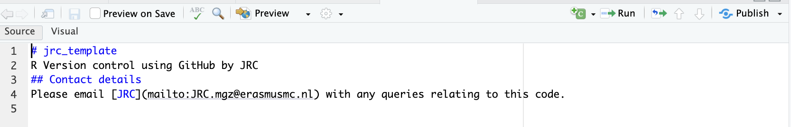

## R Version Control with Git/GitHub

Git/GitHub enables continuous software/code development by tracking code changes to the **initial commit**, tracking who made the changes and enabling code collaboration. Here I will go through the basics on how to step-up Git/GitHub for version control with R/RStudio. 

### Required programs 

To start off, ensure you have the following programs installed:

1. **Git** – the base program for tracking code changes.  
   - **Windows**: You can [download Git here](https://git-scm.com/downloads). Double-click the downloaded .exe file to start the installation process.  
   - **macOS**: First you need to install **Homebrew**. Copy and paste the Homebrew download link from (https://brew.sh/) to the Terminal and run.
   
   If you already have Homebrew installed, open Terminal and type:

     ```bash
     brew install git
     ```
2. **R** – the base R program
   - **Windows**: You can [download R here](https://cran.r-project.org/bin/windows/base/)
   - **macOS**: You can [download R here](https://cran.r-project.org/bin/macosx/)
   
3. **RStudio** – IDE (integrated development environment) for R
   - **Windows and macOS**:  You can [download RStudio here](https://posit.co/downloads/)

4. **GitHub Desktop** – for version control and collaboration
   - **Windows and macOS**:  You can [download GitHub Desktop here](https://desktop.github.com/download/)

\newpage

### Getting started 

1. **Sign up for GitHub** – Got to [GitHub](https://github.com/) and create a free account:


\vspace{3cm}

2. **Create a Repository**
After signing in, click the **+** button to create a new repository:


\newpage
3. **Fill in the repository details** (name, description, public/private, etc.) and click Create repository:
    
   

Now you have set up your **remote repository**!! 

\newpage

4. **Clone remote repository to local machine (laptop/desktop)**

Inside the repository clikc the **<>Code** button and select **Open with GitHub Desktop** in the drop down menu. 


\newpage

5. **Select path for local repository**
<center>


</center>

\newpage

6. **Add or (save your new r scripts/files) to this folder** 

This will initialize the **commit** and **push** prompt in GitHub Desktop to commit and push the changes respectively to the **remote repository**. 

These prompts enable changes made to the folder (adding new files) or files (new edits to code) on the **local** machine to be **committed and pushed** to the **remote** for tracking and hence **version control**.

**
<center>


</center>

\newpage

7. **Push** and **pull** changes to or from GitHub 

<center>


</center>

\newpage

<center>



</center>

